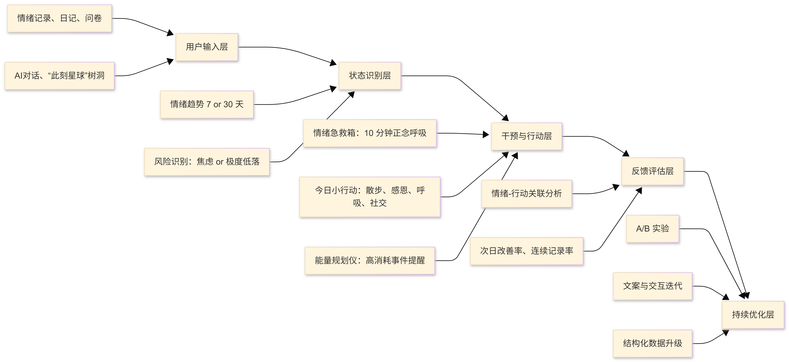

# 厦大心语

面向大学生的情绪健康管理与心理陪伴应用。项目核心是围绕一个闭环：
记录状态 -> 理解状态 -> 给出可执行行动 -> 持续反馈与修正。

<div align="center">
  
  <br/>
  <small><i>🎬 “厦大心语”核心功能演示</i></small>
</div>


<div align="center">
  
  <br/>
  <small><i>🎬 “厦大心语”agent决策过程展示</i></small>
</div>

## 整体框架结构图




## 项目详情介绍

### 1) 核心痛点与场景
在大学生高压、碎片化、低求助意愿的场景里，帮助其使用最低心理门槛把“情绪问题”转化为“可执行的小行动”，并通过数据反馈形成自我修复循环。

### 2) 细化场景
1. 状态采集：心情、睡眠、压力、精力、社交。
2. 即时干预：高风险情绪触发急救方案。
3. 行动处方：把建议降解为可打卡的微行动。
4. 反馈分析：7/30天趋势 + 情绪-行动关联。
5. 低门槛表达：AI陪伴、树洞、轻社区互助。
6. 可验证迭代：埋点、实验、游客样本、本地可调试。

### 3) 项目核心设定
“AI聊天陪伴”只是入口，关键是“记录-分析-行动-复盘”的行为闭环。

### 5) 项目核心优势
- 优势：闭环清晰、功能可验证、可持续迭代。
- 亮点功能：
1. 情绪记录 + 趋势可视化。
2. AI对话与树洞表达。
3. 微行动打卡与积分。
4. 情绪急救箱自动触发机制。
- 项目落地指标：
1. 情绪记录7日连续率。
2. 行动完成率与次日情绪改善率。
3. AI对话参与率与次留。
4. “情绪救急模式”触发后10分钟呼吸完成率。

## 详情功能模块介绍

### A. 首页与情绪记录
- 本质：让“感受”变成“可计算状态”。
- 功能清单：
1. 记录每日情绪与状态入口。
2. 记录行为后联动触发急救提醒（焦虑/极度低落）。
3. 首页展示核心导航与关键功能入口。
- 实现：
1. 状态写入在 [src/pages/Index.jsx](src/pages/Index.jsx)。
2. 触发逻辑复用急救服务 [src/services/emergencyKitService.js](src/services/emergencyKitService.js)。

### B. 日记系统
- 本质：提供叙事型自我表达，补充结构化情绪数据。
- 功能清单：
1. 新增与编辑日记内容。
2. 支持情绪、标签等日记附加信息。
3. 日记记录联动急救触发逻辑。
4. 日记图片在列表与详情页自适应展示。
- 实现：
1. 页面与弹窗分别在 [src/pages/DiaryPage.jsx](src/pages/DiaryPage.jsx)、[src/components/DiaryModal.jsx](src/components/DiaryModal.jsx)。

### C. 情绪急救箱
- 本质：在最脆弱时刻，提供最短路径干预。
- 功能清单：
1. 独立急救页面入口。
2. 高风险情绪自动推送提醒。
3. 提供10分钟正念呼吸引导与音频播放。
4. 包含来源鸣谢、版权声明与原视频链接。
- 实现：
1. 页面 [src/pages/EmergencyKitPage.jsx](src/pages/EmergencyKitPage.jsx)。
2. 通知与触发服务 [src/services/emergencyKitService.js](src/services/emergencyKitService.js)。

### D. AI陪伴对话
- 本质：降低求助门槛，而非替代专业诊疗。
- 功能清单：
1. 与AI进行情绪陪伴对话。
2. 支持聊天历史展示与持续交流。
3. 统一AI与用户头像策略并优化显示效果。
- 实现：
1. 聊天页 [src/pages/AIPage.jsx](src/pages/AIPage.jsx)。
2. 用户资料默认值 [src/context/AppContext.jsx](src/context/AppContext.jsx)。

### E. 问卷与画像
- 本质：把“长期倾向”补充到“日常状态”。
- 功能清单：
1. 情绪健康问卷填写与结果存储。
2. 混合选择模型（除睡眠外多选）。
3. 画像关键词生成、编码与去重。
4. 远程失败时本地兜底画像。
5. 按睡眠质量映射本地画像方案。
- 实现：
1. 问卷组件 [src/components/SurveyModal.jsx](src/components/SurveyModal.jsx)、[src/components/SurveySection.jsx](src/components/SurveySection.jsx)。
2. 画像逻辑 [src/pages/ProfilePage.jsx](src/pages/ProfilePage.jsx)。

### F. 趋势分析（7天/30天）
- 本质：让用户看到“变化与因果线索”，而非孤立数据点。
- 功能清单：
1. 7天/30天情绪趋势查看。
2. 多维度情绪指标可视化（mood/energy/social 等）。
3. 情绪-行动关联分析与改善率输出。
4. 时间范围联动过滤情绪与行动数据。
5. 结构化 actionType 优先归类，兼容旧数据兜底。
6. 按周期自适应图表密度（30天降采样/折线优化）。
- 实现：
1. 主逻辑在 [src/pages/TrendPage.jsx](src/pages/TrendPage.jsx)。
2. 行动写入端结构化字段在 [src/pages/ActionPage.jsx](src/pages/ActionPage.jsx)。

### G. 今日小行动（行为闭环核心）
- 本质：把“我应该调整”变成“我已经做了”。
- 功能清单：
1. 推荐行动展示与完成打卡。
2. 行动积分累计与反馈。
3. 自定义行动录入与完成记录。
4. 完成记录写入结构化 actionType。
- 实现：
1. 页面 [src/pages/ActionPage.jsx](src/pages/ActionPage.jsx)。

### H. 此刻星球（轻度互助社区）
- 本质：提供低风险、低负担的同伴支持。
- 功能清单：
1. 匿名短贴发布。
2. 预设同理/鼓励互动反馈。
3. 社区边界提示（轻支持）。
4. 发布前敏感词校验。
- 实现：
1. 页面 [src/pages/PlanetPage.jsx](src/pages/PlanetPage.jsx)。

### I. 能量规划仪
- 本质：让学习日程与心理能量管理连接起来。
- 功能清单：
1. 导入课程/日程。
2. 自动识别高能量消耗事件。
3. 事件前后提醒（浏览器通知 + 站内提示）。
4. 游客模式下提供模拟数据体验。
- 实现：
1. 服务 [src/services/energyPlannerService.js](src/services/energyPlannerService.js)。
2. 页面 [src/pages/EnergyPlannerPage.jsx](src/pages/EnergyPlannerPage.jsx)。

### J. 游客模式与演示数据
- 本质：先体验价值，再决定注册。
- 功能清单：
1. 游客无需注册即可体验核心流程。
2. 内置30天情绪样本数据。
3. 内置10条行动样本并带结构化 actionType。
4. 默认头像与测试图片本地资源化。
- 实现：
1. 测试数据 [src/data/testData.js](src/data/testData.js)。

## 技术架构

### 前端
- React 18 + Vite 5 + TailwindCSS。
- Router：React Router。
- 可视化：Recharts。


### 状态与数据
- 全局状态：Context（用户、情绪、日记、行动、聊天）。
- 存储策略：本地存储优先，支持 COS / Supabase 扩展。

### 关键工程策略
- 模块解耦：页面层、服务层、数据层分离。
- 兼容迁移：旧数据保留关键词兜底，新数据写入结构化字段。
- 本地可运行：支持关闭 NoCode 初始化阻塞。

## 运行与开发

### 环境要求
- Node.js 18+。

### 安装依赖
```bash
npm install
```

### 本地开发
```bash
npm run dev
```

默认访问地址：`http://localhost:8080/`

### Agent 后端
1. 在项目根目录创建 `.env` 文件并配置 DeepSeek Key：

```bash
DEEPSEEK_API_KEY=你的key
AGENT_SERVER_PORT=8787
KB_SOURCE_DIR=resource/knowledges
# 可选：仅调试单一文档时使用（优先级高于目录自动扫描）
# KB_SOURCE_PDF=resource/knowledges/精神障碍诊疗规范（2020年版）.pdf
KB_CHUNK_SIZE=900
KB_CHUNK_OVERLAP=180
```

2. 启动 Agent 服务：

```bash
npm run dev:server
```

3. 首次构建知识库索引（支持超长 PDF 分片）：

```bash
npm run kb:build
```

说明：
1. 当前分片器会自动扫描 `resource/knowledges` 下全部 PDF，按“逐页提取 -> 分块落盘(JSONL)”处理，支持很长的文本型 PDF。
2. 如果 PDF 是扫描版（无文本层），会出现 `chunks=0` 并给出 OCR 提示；需先 OCR 后再执行 `npm run kb:build`。
3. 可通过 `GET /api/agent/kb/status` 查看知识库是否就绪。

4. 前端开发服务保持运行：

```bash
npm run dev
```

5. 在 `.env.local` 里配置前端调用 Agent 地址（不依赖修改 vite.config.js）：

```bash
VITE_AGENT_API_BASE=http://localhost:8787
```

### 本地开发前端页面渲染
在项目根目录创建 `.env.local`：
```bash
VITE_NOCODE_MODE=disabled
VITE_AGENT_API_BASE=http://localhost:8787
```
禁用 NoCode 渲染门控
重启开发服务：
```bash
npm run dev
```

### 切回 NoCode 模式
```bash
VITE_NOCODE_MODE=enabled
```
或删除该变量后重启。

### 构建
```bash
npm run build
```

## 在线体验
- Web: https://mindful-study-space.nocode.host
- 示例截图：

## 项目结构（核心）
- 应用状态与数据入口：[src/context/AppContext.jsx](src/context/AppContext.jsx)
- 首页：[src/pages/Index.jsx](src/pages/Index.jsx)
- AI陪伴：[src/pages/AIPage.jsx](src/pages/AIPage.jsx)
- 情绪趋势：[src/pages/TrendPage.jsx](src/pages/TrendPage.jsx)
- 今日小行动：[src/pages/ActionPage.jsx](src/pages/ActionPage.jsx)
- 情绪急救箱：[src/pages/EmergencyKitPage.jsx](src/pages/EmergencyKitPage.jsx)
- 此刻星球：[src/pages/PlanetPage.jsx](src/pages/PlanetPage.jsx)
- 能量规划仪：[src/pages/EnergyPlannerPage.jsx](src/pages/EnergyPlannerPage.jsx)

## 免责声明
本项目用于学习研究、课程设计与竞赛展示，暂不作为医疗诊断或治疗工具。示例素材与测试数据仅用于*非商业演示*。

## 许可证
MIT License。见 [LICENSE.txt](LICENSE.txt)。

## 联系方式
- 作者：zxs
- 邮箱：2571293150@qq.com
- 仓库：https://github.com/WillingXu1/XiaDaXinYu_APP.git


