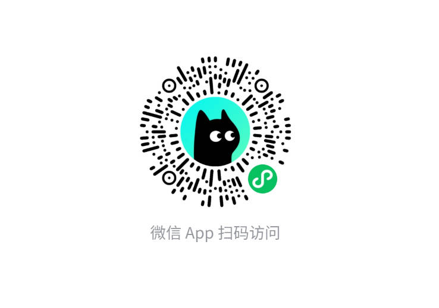

# 厦大心语

## 🚀 产品定位
本项目是一款面向高校学生的**AI情绪管理与心理陪伴应用**，以“情绪感知 + AI陪伴 + 行为闭环”为核心，帮助用户自我监测情绪变化、建立健康习惯、并在低落时获得即时支持。

<div align="center">
  
  <br/>
  <small><i>🎬 “厦大心语”核心功能演示</i></small>
</div>

## 🎯 核心场景
- **情绪跟踪**：用户可日历式记录每日心情，也可记录睡眠、压力、精力、社交等多维健康指标。
- **AI陪伴**：集成大语言模型（DeepSeek 等）提供温暖对话与建议，降低求助门槛；支持快问快答、流式消息、情绪共情。
- **匿名树洞**：用户可匿名分享心事并获得AI回复，构建低门槛的情绪表达渠道。
- **行为闭环**：提供可执行的正念、运动、社交等“微行动”任务，并通过打卡/积分增强习惯养成。

## ⚙️ 核心功能
- **情绪日记与趋势分析**：支持7/30天情绪曲线和雷达图展现，快速洞察心情波动。
- **AI对话助手**：支持流式回复、快速短语和温暖引导，提升首次交互成功率。
- **匿名树洞社区**：允许匿名发帖并获取AI回复，降低用户表达门槛。
- **行为追踪与激励**：记录“微行动”完成情况，并提供积分/奖励动机。
- **可视化转化数据**：埋点用户行为并侧显“情绪记录转化率”、“AI对话参与率”等指标。

## 📈 数据驱动与验证
- 以**数据驱动**为基础：从用户行为中提取“情绪记录转化率”、“AI对话参与率”等指标，用可量化指标指导产品优化。
- 设计“实验+验证”体系：内置A/B实验框架（文案、交互、AI问候），支持快速迭代与效果验证。
- 架构解耦+落地可执行：将AI对话、数据存储、行为追踪等模块划分清晰，便于与算法/工程协同推进。
- 强调“弱耦合AI”：Prompt可调、对话与数据分离、避免过度拟人化，聚焦“陪伴+建议”而非诊断。

## �️ 技术架构

### 核心技术栈
- **前端**：React + Vite + TailwindCSS，构建高响应的单页体验。
- **状态管理**：React Context + 自定义跟踪（行为追踪、实验管理、情绪趋势分析）。
- **AI集成**：DeepSeek（可替换为 GPT 系列）作为对话引擎，支持流式数据与Prompt调优。
- **数据存储**：本地存储为主，支持腾讯云COS（文件存储）/Supabase（关系数据）等云端存储方案。
- **可视化**：Recharts用于情绪趋势与雷达图展示。

### 主要依赖
| 依赖项 | 版本 | 说明 |
| --- | --- | --- |
| React | 18.2.0 | 核心 UI 框架 |
| Vite | 5.4.11 | 前端构建工具 |
| Tailwind CSS | 3.4.4 | 低代码样式系统 |
| Recharts | 2.12.7 | 可视化图表库 |
| Supabase JS | 2.57.4 | 后端数据存储/认证 (可选) |
| cos-js-sdk-v5 | 1.10.1 | 腾讯云对象存储集成 |
| DeepSeek（API） | V3.2 | AI 对话引擎（外部服务） |
| React Router DOM | 6.23.1 | 单页路由管理 |
| @tanstack/react-query | 5.48.0 | 数据获取与缓存 |

## �🌐 在线体验
- 访问： [https://mindful-study-space.nocode.host](https://mindful-study-space.nocode.host)
- 微信小程序体验截图：

  


## ✅ 亮点功能
- ✅ 情绪趋势分析（7天/30天曲线 + 雷达图）
- ✅ AI对话流式回复 + 快速短语（提升首聊成功率）
- ✅ 行为追踪 + 转化率分析组件（支持产品级运营指标）
- ✅ A/B实验框架（支持文本/提示词/按钮文案实验）
- ✅ 游客模式 + 注册模式双通道，降低体验门槛


## 🛠️ 环境安装指南

### NVM 安装
```bash
curl -o- https://raw.githubusercontent.com/nvm-sh/nvm/v0.39.1/install.sh | bash
```

### Node.js 18 安装
```bash
nvm install 18
nvm use 18
```

### 启动开发服务器
```bash
npm run dev
```

## ⚠️ 免责声明与用途说明
本项目用于学习研究、竞赛、课程设计与毕业设计，不具备商用资质，项目内的示例数据与资源仅作演示用途。

## 🤝 贡献指南
欢迎提交 PR 或 Issue 来优化本项目。

## 📄 许可证
本项目采用 MIT 许可证 [LICENSE](https://github.com/WillingXu1/XiaDaXinYu_APP/blob/0b0cce2c11e7e881cff65f7d181ba28b01497071/LICENSE)。

---

如有问题，可以有些邮箱联系我，也可以进行交流，项目不足之处，还请多多担待。

> **作者**: zxs  
> **邮箱**: 2571293150@qq.com   
> **GitHub**: [[XiaDaXinYu](https://github.com/WillingXu1/XiaDaXinYu_APP.git)]


