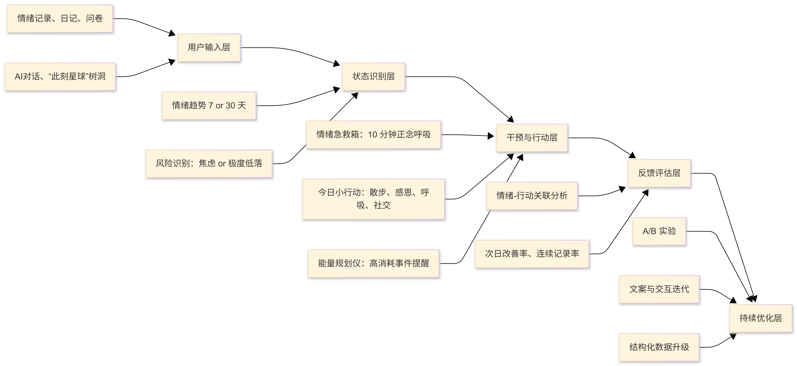
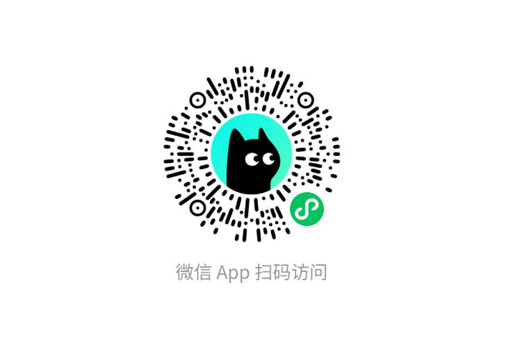

# 厦大心语

面向大学生的情绪健康管理与心理陪伴应用，核心目标是把“情绪波动”转化为“可记录、可分析、可执行、可复盘”的行为闭环。

项目当前聚焦校园高压、碎片化、低求助意愿场景，围绕 `记录状态 -> 理解状态 -> 给出行动 -> 持续反馈与修正` 展开。

在线体验：`https://mindful-study-space.nocode.host`

## 动图展示

<div align="center">
  
  <br/>
  <small><i>🎬 “厦大心语”核心功能演示</i></small>
</div>

<div align="center">
  
  <br/>
  <small><i>🎬 “厦大心语”Agent 决策过程展示</i></small>
</div>

## 项目核心亮点

### 1. 工程展示亮点

- 架构上采用前端页面层、服务层、状态层与 Agent 后端分层设计，模块职责相对清晰，便于功能扩展与答辩表达。
- 技术栈覆盖 `React 18 + Vite 5 + TailwindCSS + React Router + Recharts + Express`，前端交互和后端策略链路都可独立演示。
- 数据侧采用本地存储优先的实现方式，既降低联调门槛，也保留了 `COS / Supabase` 的扩展空间。
- 在 Agent 链路中加入 `Policy Engine + Metrics + Evaluation Harness`，把“能对话”进一步提升为“有风险分级、有 fallback、有离线评测、有结果复盘”的工程能力。
- `Policy Engine` 负责按风险等级动态收敛工具白名单、调用深度与 fallback 策略，适合体现复杂场景下的安全控制与工程治理能力。
- `Evaluation Harness` 负责样本生成、样本质检、离线 benchmark、trace replay 等评测链路，适合体现测试设计、效果验证与持续优化能力。

### 2. 项目难点 / 亮点

- 难点之一是把“情绪问题”从主观表达转成可计算状态，项目通过情绪记录、日记、问卷与画像模块共同补足短期状态和长期倾向。
- 难点之二是把建议真正落到行动层，而不是停留在聊天层，因此引入了“今日小行动”“趋势分析”“情绪-行动关联”来形成行为闭环。
- 难点之三是高风险场景下的安全控制，当前版本通过风险分级、工具白名单、最大调用深度和 fallback 策略收敛 Agent 行为，避免链路失控。
- 为了兼顾演示效果与后续优化，项目补充了游客模式、30 天样本数据、评测样本生成与质量检查脚本，降低了现场展示和离线复盘的不确定性。

### 3. 质量保障 / 测试设计

- 基础质量校验包含 `npm run lint` 与 `npm run build`，用于兜底前端代码规范与构建可用性。
- 服务端提供 `npm run test:server`，覆盖 `policy-engine`、`policy-metrics`、评测样本生成、样本质检、`trace benchmark`、`trace replay benchmark` 等关键脚本。
- 离线质量能力包含 `generate:cases`、`quality:cases`、`benchmark:policy`、`benchmark:eval-harness`、`benchmark:trace-replay`，便于对策略效果、样本质量和任务成功率做回放验证。
- 质量设计重点不在“堆测试数量”，而在“让 Agent 决策与策略优化可被复现、可被比较、可被解释”。

### 4. 个人贡献

- 当前仓库版本的工作重点集中在情绪管理闭环的页面设计与实现，覆盖首页记录、日记、趋势分析、急救箱、行动打卡、社区与能量规划等核心模块。
- 在后端侧补齐了 `Policy Engine`、策略指标统计、样本生成与 `Evaluation Harness` 链路，使项目从功能演示进一步提升到可评测、可复盘的工程项目。
- 在展示侧补充游客样本、本地兜底逻辑、结构化 `actionType` 和知识库构建流程，增强了本地可跑通和现场可演示能力。


## 项目概览

厦大心语不是单点的 AI 聊天产品，而是一个围绕情绪管理场景设计的前后端一体化项目。前端负责情绪记录、日记、问卷、行动打卡、趋势分析、轻社区等交互模块；后端 Agent 负责风险识别、策略收敛、知识库检索、决策输出与指标统计；数据层则同时承担本地持久化、游客演示数据、评测样本与离线基准回放。

从项目定位看，它更强调“工程闭环”而不是“功能堆叠”：用户从首页、日记、问卷或 AI 对话进入，系统沉淀结构化数据，再通过趋势分析、情绪急救箱、今日小行动和能量规划仪把建议落到具体动作，并通过 `Policy Engine` 与 `Evaluation Harness` 保证高风险场景下的安全边界和可验证性。

## 架构与数据流

### 技术栈

- 前端：`React 18`、`Vite 5`、`TailwindCSS`、`React Router`、`Recharts`
- 后端：`Node.js`、`Express`
- 数据与集成：`localStorage`、`COS`、`Supabase`
- 评测与知识库：`node:test`、离线 benchmark 脚本、PDF 知识库索引构建

### 架构图



### 模块边界

| 层次 | 主要职责 | 关键位置 |
| --- | --- | --- |
| 页面层 | 承载情绪记录、AI 对话、趋势分析、行动打卡、社区、能量规划等用户流程 | `src/pages/*` |
| 组件层 | 复用表单、问卷、弹窗等交互组件 | `src/components/*` |
| 状态层 | 聚合用户、情绪、日记、聊天、行动等全局状态，并通过 `localStorage` 持久化 | `src/context/AppContext.jsx` |
| 服务层 | 处理急救触发、能量规划等跨页面逻辑 | `src/services/*` |
| Agent 后端 | 负责风险评估、工具调用控制、fallback、指标统计与接口输出 | `server/agent-server.js`、`server/policy-engine.js`、`server/policy-metrics.js` |
| 数据与评测层 | 管理游客样本、离线评测用例、trace 回放报告与知识库索引 | `src/data/*`、`result/policy-eval/*`、`server/kb/*` |

### 核心数据流

1. 用户从首页、日记、问卷、AI 对话等入口输入状态，前端将情绪、行为、聊天与画像数据写入 `AppContext`。
2. `AppContext` 以 `user / moodData / diaryEntries / chatHistory / completedActions / todoActions` 为核心实体，并通过 `localStorage` 做本地持久化，保证游客模式和本地调试可用。
3. 趋势分析页读取情绪与行动数据，基于 7 天 / 30 天时间窗口做可视化，并结合结构化 `actionType` 分析情绪与行动的关联。
4. 当用户输入触发高风险信号时，前端急救流程与后端 `Policy Engine` 会共同收敛决策，优先引导到情绪急救箱、正念呼吸或安全 fallback。
5. Agent 服务端会根据 `riskLevel / allowedTools / maxDepth / fallbackMode` 控制工具链执行，必要时强制改写动作并记录 `policy_audit`。
6. 评测脚本再基于离线样本、trace 回放和指标聚合结果，反向验证策略违规率、高风险拦截率、任务成功率与错误恢复能力。

## 功能模块

| 模块 | 主要作用 | 当前边界 |
| --- | --- | --- |
| 首页与情绪记录 | 低门槛记录心情、睡眠、压力、精力、社交等状态 | 负责日常状态采集与急救提醒入口，不承担深度分析 |
| 日记系统 | 以叙事方式补充结构化情绪数据 | 支持内容、标签、情绪附加信息与图片展示 |
| 情绪急救箱 | 面向高风险情绪的最短路径干预 | 提供独立页面、触发提醒、10 分钟正念呼吸与音频播放 |
| AI 陪伴对话 | 提供低门槛表达与陪伴式交流 | 侧重情绪支持，不替代专业诊疗 |
| 问卷与画像 | 补充长期倾向与个体画像 | 负责结果存储、画像关键词生成和本地兜底 |
| 趋势分析 | 展示 7 天 / 30 天情绪变化与情绪-行动关联 | 重点是趋势与关联，不做复杂医学评估 |
| 今日小行动 | 把建议落地为可打卡的微行动 | 支持推荐行动、积分、自定义行动与完成记录 |
| 此刻星球 | 提供轻量同伴支持与表达空间 | 支持匿名短贴、预设互动与敏感词校验 |
| 能量规划仪 | 连接学习日程与心理能量管理 | 支持事件识别、提醒和游客模式演示 |
| 游客模式与演示数据 | 降低首次体验门槛，增强展示稳定性 | 提供 30 天情绪样本、行动样本与默认资源 |
| Policy Engine 与评测链路 | 收敛高风险场景下的 Agent 行为并提供量化验证 | 负责策略控制、指标统计、样本生成和离线 benchmark |

## 截图展示



## 快速启动

### 环境要求

- `Node.js 18+`

### 1. 安装依赖

```bash
npm install
```

### 2. 启动前端开发环境

```bash
npm run dev
```

默认访问地址：`http://localhost:8080/`

### 3. 如需联调 Agent，先配置后端环境变量

在项目根目录创建 `.env`：

```bash
DEEPSEEK_API_KEY=你的key
AGENT_SERVER_PORT=8787
KB_SOURCE_DIR=resource/knowledges
# 可选：仅调试单一文档时使用
# KB_SOURCE_PDF=resource/knowledges/精神障碍诊疗规范（2020年版）.pdf
KB_CHUNK_SIZE=900
KB_CHUNK_OVERLAP=180
```

### 4. 启动 Agent 服务

```bash
npm run dev:server
```

### 5. 配置前端调用 Agent 地址

在项目根目录创建 `.env.local`：

```bash
VITE_NOCODE_MODE=disabled
VITE_AGENT_API_BASE=http://localhost:8787
```

重启前端开发服务：

```bash
npm run dev
```

如果需要切回 NoCode 模式，可将 `VITE_NOCODE_MODE` 改为 `enabled` 或删除该变量后重启。

## 部署说明

### 前端构建

```bash
npm run build
```

### 知识库索引构建

首次构建知识库索引：

```bash
npm run kb:build
```

补充说明：

- 当前分片器会自动扫描 `resource/knowledges` 下的 PDF，并按“逐页提取 -> 分块落盘(JSONL)”处理。
- 如果 PDF 是扫描版且没有文本层，可能出现 `chunks=0`，需要先做 OCR 再重新执行构建。
- 可通过 `GET /api/agent/kb/status` 查看知识库是否就绪。

### Agent 部署关注点

- Agent 服务默认端口为 `8787`，前端通过 `VITE_AGENT_API_BASE` 指向对应地址。
- 风险策略相关接口可通过 `GET /api/agent/policy/metrics` 查看统计结果。
- 项目当前采用本地优先的数据策略，若后续切到云端存储，可沿用现有模块边界逐步替换。

### 质量验证与离线评测

基础校验：

```bash
npm run lint
npm run test:server
```

策略样本生成与质检：

```bash
npm run generate:cases -- --count 300 --seed 20260405 --hard-rate 0.3 --version v2-dryrun --out result/policy-eval/cases/policy-cases.v2.dryrun.json
npm run quality:cases -- --in result/policy-eval/cases/policy-cases.v2.dryrun.json --out result/policy-eval/cases/policy-cases.v2.dryrun.cleaned.json --report result/policy-eval/reports/policy-quality-report.v2-dryrun.json
```

离线 benchmark：

```bash
npm run benchmark:policy
npm run benchmark:eval-harness -- --cases result/policy-eval/cases/trace-cases.v1.campus.json --report-dir result/policy-eval/reports --baseline-tool-success-rate 0.72 --target-task-success-rate 0.90 --target-tool-call-accuracy 0.95 --target-fallback-rate 0.20
```

若需真实回放场景，可继续使用：

```bash
npm run benchmark:trace-replay
```

---

许可证：`MIT License`，见 [LICENSE.txt](LICENSE.txt)  
作者：`zxs`  
邮箱：`2571293150@qq.com`  
仓库：`https://github.com/WillingXu1/XiaDaXinYu_APP.git`
